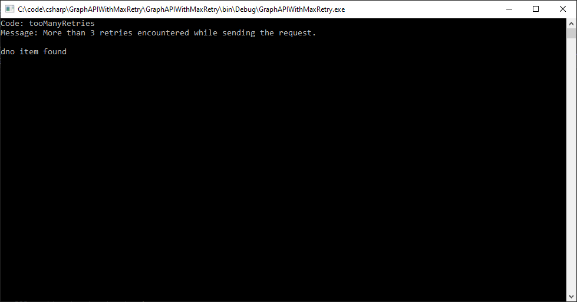

# Graph API With Max Retry

Graph API With MaxRetry Example


## Setup Your System

1. Update app settings based on your shareoint tenant [appsettings.json](./GraphAPIWithMaxRetry/appsettings.json)

1. Create Site Collection in your Tenant (Get the Site ID)
1. Create a List a SharePoint List (Get the List ID)
1. Use Graph Explorer to test your quries
1. Use Client ID and Client certificate to access to token.
1. Use [Graph Developer API](https://github.com/pnp/proxy-samples) [Testing tool](<[Title](https://github.com/microsoft/m365-developer-proxy)>) to check the retry attempts in action.
1. Pnp-Powershell [link](https://pnp.github.io/powershell)

### Create Site collection

1. Login to SharePoint Admin create site collection
2. Using team site template to create the site.
   

### Setup your data

1. use [setup.ps1](./Setup.ps1) file to create list and site columns.
1. Use the Site ID to update SiteId variable in [appsettings.json](./GraphAPIWithMaxRetry/appsettings.json)
1. Use the List ID to update SiteId variable in [appsettings.json](./GraphAPIWithMaxRetry/appsettings.json)

```
# Connect Online Site
Connect-PnPOnline -Url "https://ywzyj.sharepoint.com/sites/wcontosoteam" -UseWebLogin
# Use the ID to update SiteId variable in [appsettings.json](./GraphAPIWithMaxRetry/appsettings.json)
$site = Get-PnPSite
Get-PnPProperty -ClientObject $site -Property Id #285c9600-eb55-4263-a1cc-afb99eba839c
# Create List
New-PnPList -Title GraphQueryWithMaxRetry -Template GenericList
#Get the List ID
Get-PnPList -Identity Lists/GraphQueryWithMaxRetry #60be66d7-95dc-494a-82c8-226642fbb6a5
# Add Columns
Add-PnPField -List "GraphQueryWithMaxRetry" -InternalName "Person" -DisplayName "Person" -Type User -AddToDefaultView
Add-PnPField -List "GraphQueryWithMaxRetry" -InternalName "choiceDropdown" -DisplayName "choiceDropdown" -Type Choice -Choices  "Stockholm","Helsinki","Oslo" -AddToDefaultView

Add-PnPListItem -List "GraphQueryWithMaxRetry" -Values @{"Title" = "Test Title"; "Person"="basantpandey@ywzyj.onmicrosoft.com"; "choiceDropdown"="Helsinki"}

```

## Execute Graph Qeury with Retry Project

1.
1. Execute the code without proxy tool.
1. 
1. Download exe from [Graph API Proxy tool](<[Title](https://github.com/microsoft/m365-developer-proxy)>)

1. Open Command Prompt type.
   `m365proxy --failure-rate 50 --no-mocks --allowed-errors 429`
1. 
1. Screen output
   
